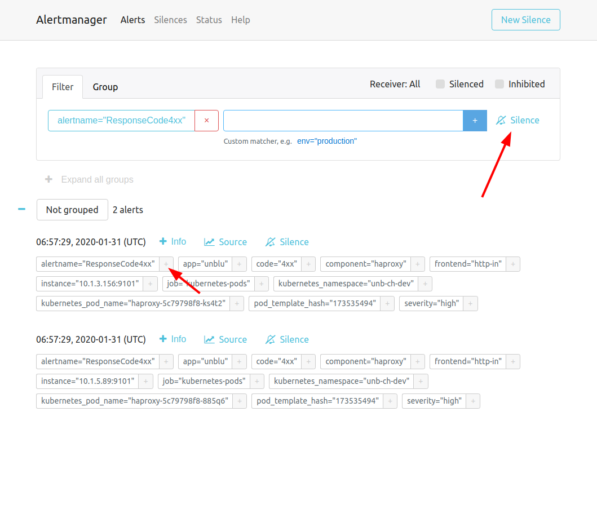
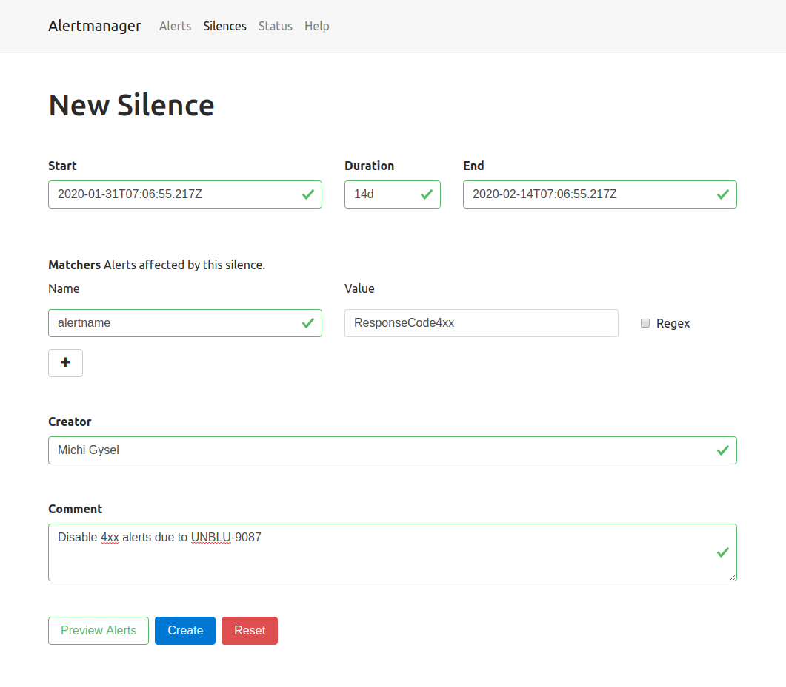

:source-highlighter: rouge

= Monitoring Unblu in Kubernetes
Michael Gysel <michael.gysel@unblu.com>
v0.3, 2020-02-13
:toc:

== Introduction

When installing Unblu into a Kubernetes cluster, 
you can choose to embed a preconfigured metrics and monitoring stack.

The components are the following.

Prometheus:: 
Continuously discovers all pods, scrapes metrics, and stores them on disk.

Grafana:: 
Visualizes metrics using dashboards, metrics are retrieved from Prometheus.

Alert Manager::
Alerts are defined in Prometheus and sent to Alert Manager which deduplciates them and then sends them to any configured outside system.

Kube State Metrics::
Agent to generate and expose cluster-level metrics. Those are scraped by Prometheus.

Blackbox Exporter::
Used by Prometheus to run HTTP probes testing the availability of certain components.

== Components

The internal workings of each component is outlined in the following sections.

=== Prometheus

Prometheus is the core of Unblu's metrics and monitoring suite and provides several different use cases:

. Discovery of all pods in the namespace using the Kubernetes API
. Scrape metrics discovered pods
. Store scraped metrics on disk
. Evaluate alert rules and send alerts them to Alert Manager
. Run queries (written in PromQL) on the metrics

Prometheus has a flexible configuration and can be used to monitor a variety of sources. 
The instance that is deployed with Unblu is configured as outlined in the following paragraphs.

Pods exposing metrics are annotated with `prometheus.io/scrape=true`. 
Metrics are then accessed using a HTTP GET on `host:80/metrics` or on the port and path specified in a separate annotation.

// every 10 seconds?

.Annotations evaluated by Unblu's Prometheus
[source,yaml]
----
annotations:
  prometheus.io/scrape: "true"
  prometheus.io/port: "7080"
  prometheus.io/path: "/sys-unblu/prometheus"
----

The HTTP metrics endpoint returns metrics in a text format:

.Prometheus metrics format
[source]
----
# documentation
metrics_name{tag="sample"} number
----

Several applications provide such a metrics endpoint out of the box, 
others have a compatible exporter converting the metrics into the Prometheus format (see https://prometheus.io/docs/instrumenting/exporters/[Prometheus exporters]).

.Prometheus metrics format
[source]
----
# HELP http_request_total http request counter
# TYPE http_request_total counter
http_request_total{handler="/",method="get",statuscode="200"} 2
http_request_total{handler="/*",method="get",statuscode="200"} 20
http_request_total{handler="/*",method="get",statuscode="302"} 3
----

Prometheus automatically deletes the old metrics when more than 6 GiB of disk space is used. Usually this results in a data retention of ~90 days, but it significantly depends on the activity in the cluster.

You can use a port forward for temporary access to Prometheus.

.Use a port forward to export Prometheus on http://localhost:9090/[localhost:9090]
[source,bash]
----
kubectl port-forward service/prometheus 9090:80
----

=== Grafana

Grafana is an open source analytics & monitoring application supporting a wide variety of data source. 
Unblu's metrics suite only uses the Prometheus data source.

All required configuration, including https://github.com/unblu-inc/unblu-kubernetes-base/tree/master/grafana/grafana-dashboards[dashboards], is automatically provisioned. The Grafana installation therefore does not use a persistent disk.

Access to Grafana from outside of the cluster is not possible by default. 
You can either use a port forward for temporary access or an Ingress/Route for permenant access.

.Use a port forward to export Grafana on http://localhost:3000/[localhost:3000]
[source,bash]
----
kubectl port-forward service/grafana 3000:80
----

Grafana is configured to create an admin user with "secret" as the https://github.com/unblu-inc/unblu-kubernetes-base/blob/master/grafana/grafana-secrets.yaml[default password].

CAUTION: Always patch the `grafana` secret to a more secure password when exposing it using an Ingress/Route.

=== Alert Manager

Prometheus is configured with an array of product specific alerts (see https://github.com/unblu-inc/unblu-kubernetes-base/blob/master/openshift-prometheus/config/alerts.yml[alerts.yaml]).

.Alert: ore than 1 failed login per second over the period of a minute
[source,yaml]
----
alert: FailedLogins
expr: "rate(session_logins_total{result="failed"}[1m]) > 1"
for: 1m
labels:
  severity: critical
annotations:
  summary: "More than 1 failed logins per second"
  description: "{{ $value }} failed logins in the last minute on {{ $labels.kubernetes_pod_name }}"
----

The alerts are evaluated by Prometheus and then sent to the AlertManager deployment.

In it's https://github.com/unblu-inc/unblu-kubernetes-base/blob/master/openshift-prometheus/config/alertmanager.yml[default configuration] no action is taken.

.Alert Manager configuration sending Slack messages and a webhook
[source,yaml]
----
global:
  slack_api_url: https://hooks.slack.com/services/<secret_part>

receivers:
- name: default-receiver
  webhook_configs:
    - url: https://webhook.site/9b8828ce-3a9a-43dc-a56c-2885b8a13b89 <1>
    # see alert webhooks on https://webhook.site/#/9b8828ce-3a9a-43dc-a56c-2885b8a13b89
  slack_configs:
    - channel: '#test' <2>
      send_resolved: true
      icon_emoji: ':rotating_light:'
      title: 'Alert: {{ .Status | toUpper }}'
      text: |
        {{ range .Alerts }} *{{ index .Annotations "summary" }}* - {{ index .Annotations "description" }} _({{ index .Labels "kubernetes_namespace" }})_
        {{ end }}

route:
  group_interval: 5m <3>
  group_wait: 10s
  receiver: default-receiver
  repeat_interval: 3h <4>
----
<1> Webhook URL to `POST` the alert to. (Consult the https://prometheus.io/docs/alerting/configuration/#webhook_config[documentation] for the exact format.)
<2> Slack channel to use when posting the alert.
<3> Only send the resolved notification when the alert was not firing for 5 minutes.
<4> Wait for 3 hours when an alert was already sent before sending it again.

Other supported channels include https://prometheus.io/docs/alerting/configuration/#email_config[Email] and https://prometheus.io/docs/alerting/configuration/#pagerduty_config[PagerDuty].

.Replace the default configuration with a project specific one in `kustomization.yaml`
[source,yaml]
----
configMapGenerator:
- name: alertmanager-config
  behavior: replace
  files:
    - alertmanager.yml
----

=== Kube State Metrics

Kube state metrics continuously polls the Kubernetes API and exposes the information is Prometheus metrics.

Examples of such metrics are:

* `kube_deployment_status_replicas_available{deployment="collaboration-server"}` - available collaboration server pods
* `kube_pod_container_info{pod="collaboration-server-68b4c86fcb-5dgkn"}` - details of a specific pod, i.e. the exact Docker image used
* `kube_pod_created{pod="kafka-1"}` - the timestamp when a specific pod was created

Some of these metrics are used in the provisioned dashboards.

=== Blackbox Exporter

Prometheus uses the blackbox exporter pod to run HTTP probes identified by the annotation `prometheus.io/probe=true` on any deployed service.

.HTTP probe configuration
[source,yaml]
----
annotations:
  prometheus.io/probe: "true"
  prometheus.io/path: "/unblu/rest/product"
  prometheus.io/probename: "Unblu"
----

By default a probe named "Unblu" is configured on the NGINX service triggering a request through all caching an load balacing layers in the cluster.

The result of this probe is exposed as Prometheus metrics.

.Metrics of the probe results
[source]
----
probe_success{kubernetes_service="nginx",probe_name="Unblu",probe_path="/unblu/rest/product"} 1
probe_http_status_code{kubernetes_service="nginx",probe_name="Unblu",probe_path="/unblu/rest/product"} 200
probe_duration_seconds{kubernetes_service="nginx",probe_name="Unblu",probe_path="/unblu/rest/product"}	0.014600436
probe_http_content_length{kubernetes_service="nginx",probe_name="Unblu",probe_path="/unblu/rest/product"}	395
----

== Integration

//Sections to be written:
//
//* Integrate Alert Manager using Slack or Email
//* Integrate Alert Manager using WebHooks

=== Federate Prometheus metrics

The Prometheus server embedded in the Unblu cluster deployment is preconfigured to scrape from all Unblu components.
It is possible duplicate this configuration (see `config/prometheus.yml`) into a company managed, shared Prometheus server.
However we do not recommend this approach as it increases the maintenance effort with every release.
A better approach is to use Prometheus https://prometheus.io/docs/prometheus/latest/federation/[federation] to scrape 
all Unblu specific metrics from the Unblu Prometheus pod and copy them in to a customer managed Prometheus.

.Prometheus federation example
[source, yaml]
----
scrape_configs:
- job_name: 'federate-unblu-prometheus'
  scrape_interval: 10s <1>
  honor_labels: true
  metrics_path: '/federate'
  params:
    'match[]':
      - '{kubernetes_namespace="unblu"}' <2>
  static_configs:
    - targets:
      - 'prometheus.unblu.svc.cluster.local:80' <2>
----
<1> The scrape interval has to be 10 seconds or less often. 
footnote:[Unblu internally collects metrics every 10 seconds.]
<2> Replace `unblu` with the actual namespace.

WARNING: Prometheus is not designed to be used as a long term storage location for data.

You can combine federation with remote write to achieve permanent storage
of metrics using https://prometheus.io/docs/operating/integrations/#remote-endpoints-and-storage[remote write].

.Prometheus remove write example using https://www.influxdata.com/products/influxdb-overview/[InfluxDB]
[source, yaml]
----
remote_write:
  - url: "https://influxdb.example.com/api/v1/prom/write?u=prometheus&p=password&db=prometheus"
----

NOTE: Remote write can also be used without federation.

== Knowledge Base

=== Silence an Alert in AlertManager

Assuming you have a known problem with your installation or you want to suppress an alert for any other reason, you can do so in AlertManager.

.Create port-forward to access AlertManager
[source,bash]
----
kubectl -n namespace port-forward service/alertmanager 9093:80
----

You can now access AlertManager on http://localhost:9093/[localhost:9093].

.List of active alerts

Now choose a label identifying the alert you want to silence (e.g. `alertname=ResponseCode4xx`) and click the **Silence** button.

.Create a new silence

A silence is valid for a duration (e.g. `14d` or `24h`) and can be documented with a creator as well as a comment.
