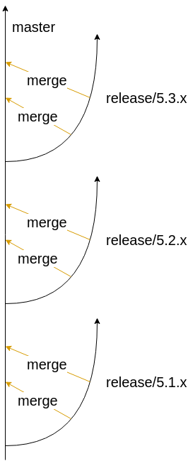

= Unblu Kubernetes Deployment

Starting from Unblu version 5, Kubernetes and OpenShift deployments are 
officially supported.

This repository serves as a basis for all cluster deployments of Unblu. To build a specific Unblu installation, follow these steps:

. Create a new Git repository
. Copy `example_kubernetes` or `example_openshift` into the new repository
. Start to modify the environment to your needs.
. Install https://github.com/kubernetes-sigs/kustomize[kustomize] on your system.
. Build the deployable YAML file: `kustomize build example_kubernetes`

Contributions to improve the Unblu deployment are very welcome. Please create a new branch for your changes and open a pull request to merge it into `master`.

== Versioning Policy

Unblu follows clearly defined versioning policy based on https://semver.org/[Semantic Versioning].
The Kubernetes setup based on this repository defines some additional rules:

* *Major* - all changes are possible
* *Minor* - components can be added or removed, replicas can be changed
* *Patch* - container image updates (only patch version increments), minor configuration changes

In case of a major or minor release, all relevant updates are communicated in the `#unblu-kubernetes-base` Slack channel.

== Branches

This repository is organised using Git branched and tags. 
Depending on how you want to build your environment, you'll reference one or the other.

* `master` is the unstable branch that may contain changes for the next major or minor version.
* `release/5.1.x`, `release/5.2.x`, ... are more stable branches. They may however contain changes for the next unreleased patch version.

*Stable environments should always reference specific Git tags of this repository!* 
Only testing/development environments may be based on `master` or `release` branches.

.The newest release branch is regularly merged back into master.

== Kustomize

Kustomize is a command line tool to create versions of a set of common Kubernetes deployment files.

IMPORTANT: At least version 2.0.2 is required! Earlier versions will not work.

Download the https://github.com/kubernetes-sigs/kustomize/releases[latest release from GitHub] and add the `kustomize` executable
to a local folder included in your `PATH` to install it.

== Modules

.Unblu Deployable Modules
|===
|Module |Includes Modules |Description

m|collaboration-server
|
|The collaboration server, ZooKeeper, and Kafka

Expects a `database` secret to be present

m|collaboration-server-with-mariadb
m|collaboration-server
|Enhances `collaboration-server` with a cluster internal MariaDB

Includes a `database` secret with default credentials

m|collaboration-server-with-postgres
m|collaboration-server
|Enhances `collaboration-server` with a cluster internal PostgreSQL

Includes a `database` secret with default credentials

m|prometheus
|
|Collects metrics from all components

m|grafana
|
|Provides visualizations of metrics, requires Prometheus. 

Database specific dashboards (MySQL, MariaDB, PostgreSQL) only work when the corresponding Prometheus exporter is also present. 
A sample exporter is the `mariadb-exporter` container in the `mariadb` deployment of `collaboration-server-with-internal-db`.

m|renderingservice
|
|Headless Chromium browser, required for Universal and Document Cobrowsing

m|k8s-ingress
m|_internal/nginx, _internal/haproxy
|Routes HTTP traffic into the cluster

m|k8s-ingress-gke
m|k8s-ingress
|Enhances the standard K8s Ingress with Google specific Load Balancer configuration

m|k8s-ingress-turn
m|_internal/turn
|Routes WebRTC traffic into the cluster, includes the turn server

m|k8s-prometheus
|
|Kubernetes compatible metrics collector

m|openshift-prometheus
|
|OpenShift compatible metrics collector

m|openshift-route
m|_internal/nginx, _internal/haproxy
|Routes HTTP traffic into the cluster

m|openshift-route-turn
m|_internal/turn
|Routes WebRTC traffic into the cluster, includes the turn server
|===

== Examples

The following examples illustrate installation scenarios:

* `example_openshift` to deploy Unblu into OpenShift
* `example_kubernetes` to deploy Unblu into Kubernetes
* `example_singlenode` to deploy Unblu into a single-node cluster (without HA)

All examples are runnable in the scope of this Git repository:

    kustomize build example_openshift > example.yaml

When creating a productive environment, you can instruct `kustomize`
to grab the sources directly from GitHub.

.kustomization.yaml pulling the bases from GitHub
[source,yaml]
----
bases:
- github.com/unblu-inc/unblu-kubernetes-base//collaboration-server
- github.com/unblu-inc/unblu-kubernetes-base//renderingservice
----

== Environment Checklist

Please make sure consider all steps below before deploying Unblu into a productive environment.

=== Docker Image Pull Secret

Every environment needs an access token to the Unblu Container Repository hosted on https://cloud.google.com/[Google Cloud Platform]. 
The image pull secret named `unblu-gcr-io` is by default attached to all used service accounts.

.gcr-secret.yaml
[source,yaml]
----
bases:
apiVersion: v1
kind: Secret
metadata:
  name: unblu-gcr-io
  labels:
    app: unblu
type: kubernetes.io/dockerconfigjson
data:
  .dockerconfigjson: >-
    DOCKER
    ACCESS 
    TOKEN 
    GOES 
    HERE
----

A `kustomize` patch can be used to replace the default Unblu image pull secret with a different one.
This is only required if you explicitly want a secret with a different name.
Using the default name (`unblu-gcr-io`) still allows you to add any content to that secret,
even a token to access a customer specific image repository.

.image-pull-secret-patch.yaml
[source,yaml]
----
apiVersion: v1
kind: ServiceAccount
metadata:
  name: default
imagePullSecrets:
  - name: different-image-pull-secret
---
kind: ServiceAccount
apiVersion: v1
metadata:
  name: renderingservice
imagePullSecrets:
  - name: different-image-pull-secret
----

The default images are pulled from the `unblu-containerrepo-public` container repository. In case you have a token that is allowed to pull from the `unblu-containerrepo-private` repository, you need to change the image names in `kustomization.yaml`.

[source,yaml]
----
# Switch all public images to the private ones
images:
  - name: gcr.io/unblu-containerrepo-public/collaborationserver-centos7
    newName: gcr.io/unblu-containerrepo-private/collaborationserver-centos7
  - name: gcr.io/unblu-containerrepo-public/rendering-service
    newName: gcr.io/unblu-containerrepo-private/rendering-service
  - name: gcr.io/unblu-containerrepo-public/cluster/nginx
    newName: gcr.io/unblu-containerrepo-private/cluster/nginx
  - name: gcr.io/unblu-containerrepo-public/cluster/haproxy
    newName: gcr.io/unblu-containerrepo-private/cluster/haproxy
  - name: gcr.io/unblu-containerrepo-public/cluster/coturn
    newName: gcr.io/unblu-containerrepo-private/cluster/coturn
----

=== TLS Certificates

This repository does not contain any certificates required for the Ingress/Routes. `TODO` markers are in place in all the
places where you need to add the real certificates! 

TIP: Use `grep -r TODO example_openshift` to find all TODOs in the `example_openshift` folder.

=== Database

This section covers managed databases. 
If you want to use an ephemeral, internal database, skip to the next section "Cluster Internal Database".

The database credentials are expected to be in a secret called `database`. 
Both users are then automatically injected into the `collaboration-server` pods.

.database-secret.yaml
[source,yaml]
----
kind: Secret
apiVersion: v1
metadata:
  name: database
  labels:
    app: unblu
type: Opaque
stringData:
  DB_USER: unblu
  DB_PASSWORD: "secret"
  DB_ADMIN_USER: "unblu-dbo"
  DB_ADMIN_PASSWORD: "even-more-secret"
----

As the database secret only contains usernames and passwords, you still need to configure all other parameters
in your `unblu-customer.properties` file.

.unblu-customer.properties for MySQL / MariaDB
[source,properties]
----
com.unblu.storage.database.url=jdbc:mysql://dbhost:3306/unblu
com.unblu.storage.database.schema=unblu
com.unblu.storage.database.liquibaseSchema=unblu
com.unblu.storage.database.driver=com.mysql.jdbc.Driver
com.unblu.storage.database.platform=org.eclipse.persistence.platform.database.MySQLPlatform
com.unblu.storage.database.jdbcProperties=connectTimeout=60000,socketTimeout=60000,useUnicode=yes,characterEncoding=UTF-8,useLegacyDatetimeCode=true,serverTimezone=UTC,useSSL=false
----

.unblu-customer.properties for PostgreSQL
[source,properties]
----
com.unblu.storage.database.url=jdbc:postgresql://dbhost:5432/unblu
com.unblu.storage.database.schema=unblu
com.unblu.storage.database.liquibaseSchema=unblu
com.unblu.storage.database.driver=org.postgresql.Driver
com.unblu.storage.database.platform=org.eclipse.persistence.platform.database.PostgreSQLPlatform
----

Instead of adding your database configuration to `unblu-customer.properties`, 
you can also create a file called `unblu-database.properties` and patch it into the `collaboration-server-config` ConfigMap.

.kustomization.yaml
[source,yaml]
----
configMapGenerator:
- name: collaboration-server-config
  behavior: merge
  files:
    - unblu-database.properties
----

=== Cluster Internal Database

The `collaboration-server-with-mariadb|postgres` modules already contain a database secret with default passwords and all 
database related settings in the file `unblu-database.properties` patched into the `collaboration-server-config` ConfigMap.

=== Text Overlays

Unblu allows changing of texts on the user interface based on an `unblu-text.properties` file. 
To make use of such a file, it can be added to the `collaboration-server-config` ConfigMap.

.kustomization.yaml
[source,yaml]
----
configMapGenerator:
- name: collaboration-server-config
  behavior: merge
  files:
    - unblu-customer.properties
    - unblu-text.properties
----

The mentioned file would then look something like this:

.unblu-text.properties
[source,properties]
----
# Text Overlays

com.unblu.conversationhistory.title.en=Conversation Demo History
----

=== Turn Secret

The WebRTC turn server requires an auth secret that is shared between the turn server and the collaboration server. 
This repository ships a globally shared secret that needs to be replaces with a secret unique to this environment for all productive installations.

A secret is a Base64 encoded random value and can be generated using the included Python script.

.Generate a new turn secret
[source,bash]
----
python3 tools/generateTurnAuthSecret.py
----

Add the secret to the collaboration server configuration.

.unblu-text.properties
[source,properties]
----
com.unblu.webrtc.credentialsecretkey=MY_SECRET
----

Then also patch the secret into the exiting Kubernetes secred named `turn`.

.kustomization.yaml
[source,yaml]
----
patchesStrategicMerge:
- turn-secret.yaml
----

.turn-secret.yaml
[source,yaml]
----
kind: Secret
apiVersion: v1
metadata:
  name: turn
type: Opaque
stringData:
  AUTH_SECRET: MY_SECRET
----

== Troubleshooting

Redeploy all CollaborationServer/Kafka/ZooKeeper pods:

    kubectl -n your-namespace delete pods --grace-period=0 --force -l "component in (zookeeper, kafka, collaboration-server)"
